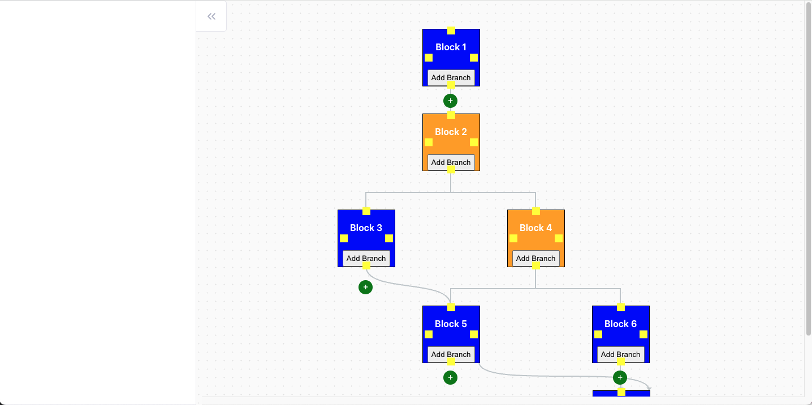

# FlowBuilder

**FlowBuilder** is an open-source, lightweight, and flexible flow builder designed to make process mapping simple, intuitive, and manageable. Unlike other flow libraries, FlowBuilder avoids unnecessary bulkiness and focuses on delivering a streamlined experience for developers. With easy setup and rich customization options, FlowBuilder enables users to create and visualize workflows effectively.

WIP...

## Features

- **Manual Link Creation**: Quickly establish connections between blocks by manually selecting link points.
- **Automatic & Programmatic Linking:** Automate connections based on predefined logic or create links programmatically as your application scales.
- **Branching**: Easily design complex workflows with branching logic and merges, supporting diverse use cases.
- **Lightweight and Performant**: Built with simplicity in mind, FlowBuilder is optimized to be lightweight, with minimal setup required.

## Why FlowBuilder?

FlowBuilder fills the gap between heavy, complex flow solutions and simpler, more manageable setups. Designed to support various workflow applications, FlowBuilder gives developers the freedom to customize and integrate workflows without the overhead.

## Use Cases
- **AI Event-based Workflow Automation:** Perfect for AI tools that need dynamic flow designs to handle conditional and event-based workflows. Define sequences for actions based on real-time events and improve decision-making automation.
- **Marketing Automation Tools:** Ideal for mail marketing workflows and campaign automation, allowing marketing teams to visualize customer journeys, manage touchpoints, and streamline campaign flows.
- **Business Process Automation:** Tailored for enterprise process automation, FlowBuilder is a great fit for designing complex business workflows. [Madgeek](https://www.madgeek.in), a leader in enterprise tools, specializes in creating solutions that simplify business processes and boost operational efficiency.

### Credits

This project was inspired by and borrows ideas from the following open-source projects:

- [Flowy](https://github.com/alyssaxuu/flowy): A simple drag-and-drop library for creating flowcharts and workflows.
- [Drawflow](https://github.com/jerosoler/Drawflow): A JavaScript library for creating flowcharts and diagrams with a user-friendly interface.
- [Xyflow](https://github.com/xyflow/xyflow): A flow chart library that emphasizes ease of use and flexibility for developers.
- [flow-builder](https://github.com/bytedance/flow-builder): A highly customizable streaming flow builder.

Thank you for your contributions to the open-source community!

## Contributing
We encourage contributions to improve FlowBuilder! Here are a few guidelines to ensure a smooth collaboration:

- **Be Respectful and Collaborative:** Open-source is a collaborative space, and contributions are encouraged! Instead of requesting features, consider joining the development effort by sharing ideas, fixing bugs, or implementing functionalities.
- **Raise Issues Thoughtfully:** If you encounter issues, please describe them clearly and include steps to reproduce. This will help the community better understand and resolve them.
- **Submit PRs with Care:** When submitting a pull request, ensure your code follows project conventions and includes comments where necessary.

- Let’s work together to make FlowBuilder better, one contribution at a time!

## 💕 Sponsor FlowBuilder

If you find this project useful and would like to support its development, consider [sponsoring me on GitHub](https://github.com/sponsors/1Madgeek).

We are grateful to the following individuals and organizations for supporting this project:

<table>
  <tr>
    <td align="center">
      <a href="https://github.com/1Madgeek">
        
         
        <b>Madgeek</b>
      </a>
    </td>
  </tr>
</table>

Want to see your profile here? [Become a sponsor](https://github.com/sponsors/1Madgeek)!
