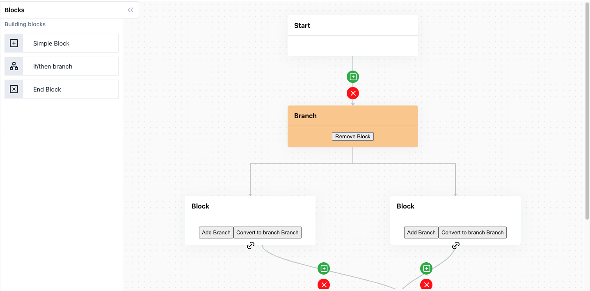

# FlowBuilder

**FlowBuilder** is an open-source, lightweight, and flexible flow builder designed to make process mapping simple,
intuitive, and manageable. Unlike other flow libraries, FlowBuilder avoids unnecessary bulkiness and focuses on
delivering a streamlined experience for developers. With easy setup and rich customization options, FlowBuilder enables
users to create and visualize workflows effectively.

WIP...



## Getting Started

### Installation
```bash
# npm
npm install @madgeek_in/react-flow-builder

# yarn
yarn add @madgeek_in/react-flow-builder
```

### Usage
```javascript
import {FlowBuilder} from '@madgeek_in/react-flow-builder';

<FlowBuilder allowDragging={true} flow={'vertical'}/>
```

## Demo

[React Flow Builder Demo](https://react-flow-builder-demo.vercel.app/)

## Features

- **Manual Link Creation**: Quickly establish connections between blocks by manually selecting link points.
- **Automatic & Programmatic Linking:** Automate connections based on predefined logic or create links programmatically
  as your application scales.
- **Branching**: Easily design complex workflows with branching logic and merges, supporting diverse use cases.
- **Lightweight and Performant**: Built with simplicity in mind, FlowBuilder is optimized to be lightweight, with
  minimal setup required.

## Why FlowBuilder?

FlowBuilder fills the gap between heavy, complex flow solutions and simpler, more manageable setups. Designed to support
various workflow applications, FlowBuilder gives developers the freedom to customize and integrate workflows without the
overhead.

## Flow Builder Features and Functionalities

### Core Features

1. [x] **Block Management:**
    - **Add Blocks**: Dynamically add blocks to the canvas.
    - **Remove Blocks**: Remove blocks and automatically delete their descendant blocks.
    - **Convert Block to Branch**: Transform a regular block into a branch block with constraints to maintain positive
      and negative paths.

2. [x] **Branch Logic:**
    - **Positive and Negative Paths**: Ensure each branch block maintains exactly two children, representing positive
      and negative paths.
    - **Prevent Invalid Branch Creation**: Disallow conversion if the block violates branch constraints (e.g., more than
      two descendants).

3. [x] **Link Management:**
    - **Create Links**: Connect blocks to establish flow paths.
    - **Remove Links**: Remove links, and if resulting blocks are disjointed (i.e., not connected to a root), remove
      those blocks.

4. [x] **Drag-and-Drop Functionality:**
    - **Individual Block Movement**: Allow users to drag individual blocks to new positions.
    - **Canvas Drag**: Enable dragging of the entire canvas and its content if specific user settings are selected.

5. [x] **Auto-Arrangement and Centering:**
    - **Arrange Blocks**: Automatically center blocks horizontally while maintaining their top positions.
    - **Responsive Positioning**: Dynamic adjustment for different screen sizes.

### User Interface Features

1. [x] **Interactive Elements:**
    - **"+" Button**: Add new blocks to existing connections.
    - **"Remove" Button**: Remove blocks or links through direct interaction.

2. [x] **Styling and Display:**
    - **Block Appearance**: Differentiate block types with unique colors and labels using a consistent design language.
    - **Connection Paths**: Render connections with SVG paths, adjusting for straight or "L"-shaped paths to indicate
      flow or branching.

### Notifications and Feedback

1. [ ] **Alert Messages**: Provide user-friendly notifications when disallowed actions are attempted (e.g., trying to
   delete protected branch children).

2. [ ] **In-App Guidance**: Tooltips or instructional text for first-time users or complex actions.

### Advanced Functionalities

1. [ ] **Undo/Redo Functionality**: Allow users to undo or redo their most recent changes.

2. [ ] **Exporting Workflows**: Provide options to save or export workflow configurations for sharing or later use.

3. [ ] **Enhanced Conditional Logic**: Enable complex branching conditions, allowing for more advanced workflows based
   on dynamic data or inputs.

4. [ ] **Customizable UI**: Options for users to customize the look and feel of their canvas, blocks, and connections.

### Future Enhancements

1. [ ] **Collaboration Features**: Enable multiple users to collaborate on the same workflow in real-time.

2. [ ] **Zoom and Pan Controls**: Implement zooming and panning to navigate larger workflows easily.

3. [ ] **Version Control**: Maintain history and versioning for workflows, providing rollback capabilities.

4. [ ] **Elements/Block Panel**: List of blocks to choose from when creating a block.

5. [ ] **Block Property Panel**: Block configuration panel like [Elementor](https://github.com/elementor/elementor).

6. [ ] **Drag & Drop Block**: Allow dragging & dropping blocks from the block lists into the canvas.

7. [ ] **Auto Snapping**: Automatically snap to an existing block and create links.

8. [ ] **Start Node**: Allow start node configuration to determine if the flow should be executed.

9. [ ] **End Node**: Allow blocks to be of type "End". Blocks of type end won't have any descendents and stop the flow. 

## Use Cases

- **AI Event-based Workflow Automation:** Perfect for AI tools that need dynamic flow designs to handle conditional and
  event-based workflows. Define sequences for actions based on real-time events and improve decision-making automation.

- **Marketing Automation Tools:** Ideal for mail marketing workflows and campaign automation, allowing marketing teams
  to visualize customer journeys, manage touchpoints, and streamline campaign flows.

- **Business Process Automation:** Tailored for enterprise process automation, FlowBuilder is a great fit for designing
  complex business workflows. [Madgeek](https://www.madgeek.in), a leader in enterprise tools, specializes in creating
  solutions that simplify business processes and boost operational efficiency.

### Credits

This project was inspired by and borrows ideas from the following open-source projects:

- [Flowy](https://github.com/alyssaxuu/flowy): A simple drag-and-drop library for creating flowcharts and workflows.
- [Drawflow](https://github.com/jerosoler/Drawflow): A JavaScript library for creating flowcharts and diagrams with a
  user-friendly interface.
- [Xyflow](https://github.com/xyflow/xyflow): A flow chart library that emphasizes ease of use and flexibility for
  developers.
- [flow-builder](https://github.com/bytedance/flow-builder): A highly customizable streaming flow builder.

Thank you for your contributions to the open-source community!

### Open Source Libraries Used

This project utilizes several open-source libraries to provide a robust and responsive experience:

- [React](https://reactjs.org/): A JavaScript library for building user interfaces, providing the foundation for responsive and dynamic components.
- [Tabler Icons](https://tabler-icons.io/): A set of customizable and responsive SVG icons, enhancing the visual appeal and usability of the application.

A huge thank you to these open-source communities for their invaluable contributions!

## Contributing

We encourage contributions to improve FlowBuilder! Here are a few guidelines to ensure a smooth collaboration:

- **Be Respectful and Collaborative:** Open-source is a collaborative space, and contributions are encouraged! Instead
  of requesting features, consider joining the development effort by sharing ideas, fixing bugs, or implementing
  functionalities.
- **Raise Issues Thoughtfully:** If you encounter issues, please describe them clearly and include steps to reproduce.
  This will help the community better understand and resolve them.
- **Submit PRs with Care:** When submitting a pull request, ensure your code follows project conventions and includes
  comments where necessary.

- Let’s work together to make FlowBuilder better, one contribution at a time!

## 💕 Sponsor FlowBuilder

[](https://github.com/sponsors/1Madgeek)

If you find this project useful and would like to support its development,
consider [sponsoring me on GitHub](https://github.com/sponsors/1Madgeek).

We are grateful to the following individuals and organizations for supporting this project:

<table>
  <tr>
    <td align="center">
      <a href="https://github.com/1Madgeek">
        
        <br/>
        <sub><b>Madgeek</b></sub>
      </a>
    </td>
  </tr>
</table>

Want to see your profile here? [Become a sponsor](https://github.com/sponsors/1Madgeek)!
